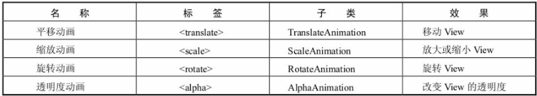

# 动画

## 帧动画

需要多张图片作为一个动画的一个个帧，然后进行播放。在xml中定义则是：
```xml
<animation-list xmlns:android="http://schemas.android.com/apk/res/android"
    android:oneshot="false">
    <item android:drawable="@drawable/baseline_accessibility_new_pink_200_24dp" android:duration="1000" />
    <item android:drawable="@drawable/baseline_accessibility_pink_200_24dp" android:duration="1000" />
    <item android:drawable="@drawable/baseline_accessible_forward_pink_200_24dp" android:duration="1000" />
    <item android:drawable="@drawable/baseline_accessible_pink_200_24dp" android:duration="1000"/>
</animation-list>

<!--android:oneshot="false"判断动画自动播放的使用是否只播放一次-->
```

然后将此`drawable`设置到某个图片容器中即可

```java
private lateinit var drawableAnimation: AnimationDrawable

binding.ivDrawableAnimation.apply {
     setBackgroundResource(R.drawable.animation_drawable)
     drawableAnimation = background as AnimationDrawable
}

drawableAnimation.start()
```

## `View`动画

View动画是Android一开始就提供的比较原始的动画，主要支持四种效果：平移、缩放、旋转、透明度变化（渐变） 四种基本效果，我们可以再这四种基础效果的基础上，选择其中的几种进行组合。

View动画的四种基本效果对应了四个Animation的子类


在xml中使用则是:
```xml
<set xmlns:android="http://schemas.android.com/apk/res/android"
    android:fillAfter="false"
    android:zAdjustment="normal">
    <translate
        android:duration="1000"
        android:fromXDelta="0"
        android:fromYDelta="0"
        android:interpolator="@android:anim/linear_interpolator"
        android:toXDelta="100"
        android:toYDelta="100" />
    <rotate
        android:duration="1000"
        android:fromDegrees="0"
        android:toDegrees="360"/>
    <scale
        android:duration="1000"
        android:fromXScale="1"
        android:fromYScale="1"
        android:toXScale="2"
        android:toYScale="2"/>
    <alpha
        android:duration="1000"
        android:fromAlpha="0"
        android:toAlpha="1"/>
</set>

<!--android:interpolator是可以定义动画的插值情况，下面会讲到interpolator的使用方法-->
```

在代码中使用定义的xml文件
```java
binding.btn.setOnClickListener {
    val viewAnim = AnimationUtils.loadAnimation(this, R.anim.animation_test)
    binding.btn.startAnimation(viewAnim)
}

```

也可以直接在代码中实现
```java
val rotateAnimation = RotateAnimation(0f, 360f)
val alphaAnimation = AlphaAnimation(0f, 1f)
val translateAnimation = TranslateAnimation(0f, 0f, 100f, 100f)
val scaleAnimation = ScaleAnimation(0f, 2f, 0f, 1f)
val animationSet = AnimationSet(true)
animationSet.addAnimation(rotateAnimation)
animationSet.addAnimation(alphaAnimation)
animationSet.addAnimation(translateAnimation)
animationSet.addAnimation(scaleAnimation)
animationSet.duration=4000
animationSet.repeatCount=2
animationSet.repeatMode=Animation.REVERSE
binding.btn.setOnClickListener {
    it.startAnimation(animationSet)
}
```

## 属性动画

属性动画的实现主要通过两个类进行

- `ValueAnimator`类：不断改变值，然后手动赋值给对象的属性从而实现动画效果，是间接对对象属性进行操作；
- `ObjectAnimator`类：不断改变值，然后自动赋值给对象的属性从而实现动画效果，是直接对对象属性进行操作；
可以理解为：`ObjectAnimator`类的使用更加智能、自动化程度更高。

### `ValueAnimator`

通过不断控制 值 的变化，再不断 手动 赋给对象的属性，从而实现动画效果。

`ValueAnimator`主要有以下的一些方法生成一个`ValueAnimator`
```java
1. ValueAnimator.ofInt（int values）
2. ValueAnimator.ofFloat（float values）
3. ValueAnimator.ofObject（int values）
但是其实还有另外的几个方法:
4. ValueAnimator.ofPropertyValuesHolder(PropertyValuesHolder values)
5. ValueAnimator.ofArgb(int values)
```

`ValueAnimator.ofInt`的使用方式:
**`ValueAnimator.ofFloat`和`ValueAnimator.ofInt`的使用方式可以说是一模一样**
```xml
/*
 * 设置方式1：xml
 */
// 步骤1：在路径 res/animator的文件夹里创建相应的动画 .xml文件 - set_animation.xml

// 步骤2：设置动画参数
// ValueAnimator采用<animator>  标签
<animator xmlns:android="http://schemas.android.com/apk/res/android"  
    android:valueFrom="0"   // 初始值
    android:valueTo="3"  // 结束值
    android:valueType="intType" // 变化值类型 ：floatType & intType

    android:duration="3000" // 动画持续时间（ms），必须设置，动画才有效果
    android:startOffset ="1000" // 动画延迟开始时间（ms）
    android:fillBefore = “true” // 动画播放完后，视图是否会停留在动画开始的状态，默认为true
    android:fillAfter = “false” // 动画播放完后，视图是否会停留在动画结束的状态，优先于fillBefore值，默认为false
    android:fillEnabled= “true” // 是否应用fillBefore值，对fillAfter值无影响，默认为true
    android:repeatMode= “restart” // 选择重复播放动画模式，restart代表正序重放，reverse代表倒序回放，默认为restart|
    android:repeatCount = “0” // 重放次数（所以动画的播放次数=重放次数+1），为infinite时无限重复
    android:interpolator = @[package:]anim/interpolator_resource // 插值器，即影响动画的播放速度,下面会详细讲
/> 
```
```java

// 步骤3：启动动画
    // 载入XML动画
    Animator animator = AnimatorInflater.loadAnimator(context, R.animator.set_animation);  
    // 设置动画对象
    animator.setTarget(view);  
    // 启动动画
    animator.start();  
```
```java
/*
 * 设置方式2：Java
 */
// 步骤1：设置动画属性的初始值 & 结束值
    ValueAnimator anim = ValueAnimator.ofInt(0, 3);
    // ofInt()作用：
    // 1. 创建动画实例
    // 2. 将传入的多个Int参数进行平滑过渡:此处传入0和3,表示将值从0平滑过渡到3
    // 如果传入了3个Int参数 a,b,c ,则是先从a平滑过渡到b,再从b平滑过渡到C，以此类推
    // ValueAnimator.ofInt()内置了整型估值器,直接采用默认的.不需要设置，即默认设置了如何从初始值 过渡到 结束值
    // 关于自定义插值器我将在下节进行讲解
    // 下面看看ofInt()的源码分析 ->>关注1

    // 关注1：ofInt（）源码分析
    public static ValueAnimator ofInt(int... values) {
    // 允许传入一个或多个Int参数
    // 1. 输入一个的情况（如a）：从0过渡到a；
    // 2. 输入多个的情况（如a，b，c）：先从a平滑过渡到b，再从b平滑过渡到C

    ValueAnimator anim = new ValueAnimator();
    // 创建动画对象
    anim.setIntValues(values);
    // 将传入的值赋值给动画对象
    return anim;
}

// 步骤2：设置动画的播放各种属性
    // 设置动画运行的时长
    anim.setDuration(500); 
    
    // 设置动画延迟播放时间
    anim.setStartDelay(500); 

    // 设置动画重复播放次数 = 重放次数+1
    // 动画播放次数 = infinite时,动画无限重复
    anim.setRepeatCount(0);
    
    // 设置重复播放动画模式
    anim.setRepeatMode(ValueAnimator.RESTART);
    // ValueAnimator.RESTART(默认):正序重放
    // ValueAnimator.REVERSE:倒序回放

// 步骤3：将改变的值手动赋值给对象的属性值：通过动画的更新监听器
// 设置值的更新监听器，即：值每次改变、变化一次,该方法就会被调用一次
    anim.addUpdateListener(new ValueAnimator.AnimatorUpdateListener() {
        @Override
        public void onAnimationUpdate(ValueAnimator animation) {

        // 获得改变后的值
        int currentValue = (Integer) animation.getAnimatedValue();

        // 将改变后的值赋给对象的属性值，下面会详细说明
        View.setproperty（currentValue）；

        // 刷新视图，即重新绘制，从而实现动画效果
        View.requestLayout();
             }
        });

// 步骤4：启动动画
  anim.start();
值 从初始值 过度到 结束值 的过程如下效果图：
```

`ValueAnimator.ofObject`的使用方式

`ValueAnimator.ofObject`与`ValueAnimator.ofInt`使用的不同点是前者可以直接传入任何类作为动画变化的参数，但是同时需要设置估值器，才能正确转换。

```java
public class Tran {
    private float x;
    private float y;

    public Tran() {
    }

    public Tran(float x, float y) {
        this.x = x;
        this.y = y;
    }

    public float getX() {
        return x;
    }

    public void setX(float x) {
        this.x = x;
    }

    public float getY() {
        return y;
    }

    public void setY(float y) {
        this.y = y;
    }
}

binding.btnValueAnimator.post{
    val x = binding.btnValueAnimator.x
    valueAnimator7 = ValueAnimator.ofObject(TypeEv(),
        Tran(binding.btnValueAnimator.x, binding.btnValueAnimator.y),
        Tran(binding.btnValueAnimator.x*5 , binding.btnValueAnimator.y*5 ))
        valueAnimator7.apply {
            duration=1000
            repeatCount=0
            repeatMode=ValueAnimator.REVERSE
            addUpdateListener { animation->
                val animatedValue = animation.animatedValue as Tran
                binding.btnValueAnimator.x=animatedValue.x
                binding.btnValueAnimator.y=animatedValue.y
            }
        }
    }
```

### `ObjectAnimator`
`ObjectAnimator`用起来和`ValueAnimator`的差别不大，只不过是`ObjectAnimator`把`ValueAnimator`封装了一层

**比如：`ofFloat()`**
```java

ofFloat(Object target, String propertyName, float... values)

ofFloat(T target, Property<T, Float> property,float... values)

ofMultiFloat(Object target, String propertyName,float[][]values)

ofMultiFloat(Object target, String propertyName, Path path)

ofMultiFloat(Object target, String propertyName,
            TypeConverter<T, float[]> converter, TypeEvaluator<T> evaluator, T... values)
```
可以看出我们在使用ObjectAnimator的时候只需要设置那个控件target作为动画的作用对象,然后propertyName是要操作的属性
- 要添加动画效果的对象属性必须具有 set<PropertyName>() 形式的 setter 函数（采用驼峰式大小写形式）。由于 ObjectAnimator 会在动画过程中自动更新属性，它必须能够使用此 setter 方法访问该属性。例如，如果属性名称为 foo，则需要使用 setFoo() 方法。如果此 setter 方法不存在，您有三个选择：
    - 如果您有权限，可将 setter 方法添加到类中。
    - 使用您有权更改的封装容器类，让该封装容器使用有效的 setter 方法接收值并将其转发给原始对象。
    - 改用 ValueAnimator。

**比如:**
```java
objectAnimator1 = ObjectAnimator.ofFloat(binding.btnObjectAnimator, "translationX", 0f,600f)

objectAnimator1.apply {
    duration=3000
    repeatMode=ObjectAnimator.REVERSE
    repeatCount=0
    interpolator=AnticipateInterpolator()
}
```

**其他的比如**
- `ofInt()`
- `ofObject()`
- `ofPropertyValuesHolder()`
- `ofMultiInt()`

都大同小异

### `PropertyValuesHolder`
我们在使用`ValueAnimator`或者`ObjectAnimator`的时候有一个
`ofPropertyValuesHolder()`方法，里面的参数是`PropertyValuesHolder`。
可以帮助我们在一个`animator`中改变控件多个参数

**比如**:
```java
PropertyValuesHolder.ofInt()
PropertyValuesHolder.ofFloat()
PropertyValuesHolder.ofObject()
PropertyValuesHolder.ofKeyFrame()
PropertyValuesHolder.ofMultiInt()
PropertyValuesHolder.ofMultiFloat()
```
都可以提前把目标和参数设置好然后直接在`ValueAnimator`或者`ObjectAnimator`中使用

**实例**
```java
binding.btnPropertyValuesHolder.post{
            val propertyX = PropertyValuesHolder.ofFloat("translationX",
                binding.btnPropertyValuesHolder.translationX,
                500f)
            val propertyY = PropertyValuesHolder.ofFloat("translationY",//距离:px
                binding.btnPropertyValuesHolder.translationX,
                500f)
            val propertyAlpha=PropertyValuesHolder.ofFloat("alpha",0f,1f)//透明度:0~1
            val propertyRotation=PropertyValuesHolder.ofFloat("rotation",0f,360f)//角度:度数制


            val array = Array(3){
                FloatArray(2)
            }
            array[0][0]=500f
            array[0][1]=300f
            array[1][0]=500f
            array[1][1]=1000f
            array[2][0]=500f
            array[2][1]=300f
            val propertyLayoutParams = PropertyValuesHolder.ofMultiFloat("layoutParams",array)


            val path = Path()
            path.quadTo(0f,0f,500f,1000f)
            path.quadTo(200f,200f,300f,100f)
            val propertyPath = PropertyValuesHolder.ofMultiFloat("path", path)

            val propertyTran = PropertyValuesHolder.ofMultiFloat("tran",
                TranConverter(Tran::class.java, FloatArray::class.java),
                TranEvaluator(),
                Tran(0f, 0f),
                Tran(600f, 1200f))

            PropertyValuesHolder.of


            val k0 = Keyframe.ofFloat(0.125f, 1f)
            val k1 = Keyframe.ofFloat(0.275f, 0.1f)
            val k2 = Keyframe.ofFloat(0.69f, 0.5f)
            val k3 = Keyframe.ofFloat(1f, 1f)
            val propertyKeyframe = PropertyValuesHolder.ofKeyframe("keyframe", k0, k1, k2, k3)


            //PropertyValuesHolder.ofFloat(Property.of())
            valueAnimator = ValueAnimator.ofPropertyValuesHolder(propertyX, propertyY,propertyAlpha,propertyRotation,propertyLayoutParams,propertyPath,propertyTran,propertyKeyframe)
            valueAnimator.apply {
                duration=5000
                repeatCount=0
                repeatMode=ValueAnimator.REVERSE
                addUpdateListener { animation->
                    /*val currX = animation.getAnimatedValue("translationX") as Float
                    val currY = animation.getAnimatedValue("translationY") as Float*/
                    val currAlpha=animation.getAnimatedValue("alpha") as Float
                    val currRotation=animation.getAnimatedValue("rotation") as Float
                    val currLayoutParams = animation.getAnimatedValue("layoutParams") as FloatArray
                    val currPath = animation.getAnimatedValue("path") as FloatArray
                    val currTran = animation.getAnimatedValue("tran") as FloatArray
                    val currKeyframe = animation.getAnimatedValue("keyframe") as Float

                    //binding.btnPropertyValuesHolder.translationX=currX
                    //binding.btnPropertyValuesHolder.translationY=currY
                    //binding.btnPropertyValuesHolder.alpha=currAlpha
                    binding.btnPropertyValuesHolder.apply {
                        rotationX=currRotation
                        rotationY=currRotation

                        val mLayoutParams = layoutParams
                        mLayoutParams.width= currLayoutParams[0].toInt()
                        mLayoutParams.height=currLayoutParams[1].toInt()
                        layoutParams=mLayoutParams

                        x=currTran[0]
                        y=currTran[1]
                        alpha=currKeyframe
                        /*x=currPath[0]
                        y=currPath[1]*/
                    }
                }
            }
        }

```
**虽然有些参数在控件中存在`get`和`set`方法，但是也不能直接通过`propertyName`来设置使用,比如`layoutParams`**

#### 估值器
|IntEvaluator|	这是用于计算 int 属性的值的默认评估程序。|
|:---:|:---|
|FloatEvaluator|	这是用于计算 float 属性的值的默认评估程序。|
|ArgbEvaluator|	这是用于计算颜色属性的值（用十六进制值表示）的默认评估程序。|
|TypeEvaluator|	此接口用于创建您自己的评估程序。如果您要添加动画效果的对象属性不是 int、float 或颜色，那么您必须实现 TypeEvaluator 接口，才能指定如何计算对象属性添加动画效果之后的值。如果您想以不同于默认行为的方式处理 int、float和颜色，您还可以为这些类型的值指定自定义 TypeEvaluator。如需详细了解如何编写自定义评估程序，请参阅使用 TypeEvaluator 部分。|

**比如**
```java
val layoutParams1 = ConstraintLayout.LayoutParams(500, 300)
val layoutParams2 = ConstraintLayout.LayoutParams(200, 1000)
val layoutParams3 = ConstraintLayout.LayoutParams(400, 200)
objectAnimator3 = ObjectAnimator.ofObject(binding.btnObjectAnimator,"layoutParams",
    object : TypeEvaluator<ViewGroup.LayoutParams>{
        override fun evaluate(
            fraction: Float,
            startValue: ViewGroup.LayoutParams?,
            endValue: ViewGroup.LayoutParams?
            ): ViewGroup.LayoutParams {
                val layoutParams = ViewGroup.LayoutParams(0, 0)
                layoutParams.width =
                    ((endValue!!.width - startValue!!.width) * fraction + startValue.width).toInt()
                layoutParams.height =
                    ((endValue.height - startValue.height) * fraction + startValue.height).toInt()
                return layoutParams
            }
    },layoutParams1,layoutParams2,layoutParams3)
```

#### 插值器
|类/接口|	说明|
|:---:|:---:|
|AccelerateDecelerateInterpolator|	该插值器的变化率在开始和结束时缓慢但在中间会加快。|
|AccelerateInterpolator|	该插值器的变化率在开始时较为缓慢，然后会加快。|
|AnticipateInterpolator|	该插值器先反向变化，然后再急速正向变化。|
|AnticipateOvershootInterpolator|	该插值器先反向变化，再急速正向变化，然后超过定位值，最后返回到最终值。|
|BounceInterpolator|	该插值器的变化会跳过结尾处。|
|CycleInterpolator|	该插值器的动画会在指定数量的周期内重复。|
|DecelerateInterpolator|	该插值器的变化率开始很快，然后减速。|
|LinearInterpolator|	该插值器的变化率恒定不变。|
|OvershootInterpolator|	该插值器会急速正向变化，再超出最终值，然后返回。|
|TimeInterpolator|	该接口用于实现您自己的插值器。|

**比如**
```java
animatorSet.apply {
            interpolator= AccelerateDecelerateInterpolator()//该插值器的变化率在开始和结束时缓慢但在中间会加快
            interpolator=AccelerateInterpolator()//该插值器的变化率在开始时较为缓慢，然后会加快。
            interpolator=AnticipateInterpolator()	//该插值器先反向变化，然后再急速正向变化。
            interpolator=AnticipateOvershootInterpolator()	//该插值器先反向变化，再急速正向变化，然后超过定位值，最后返回到最终值。
            interpolator=BounceInterpolator()	//该插值器的变化会跳过结尾处。
            interpolator=CycleInterpolator(2f)	//该插值器的动画会在指定数量的周期内重复。
            interpolator=DecelerateInterpolator()	//该插值器的变化率开始很快，然后减速。
            interpolator=LinearInterpolator()	//该插值器的变化率恒定不变。
            interpolator=OvershootInterpolator()	//该插值器会急速正向变化，再超出最终值，然后返回。
            setInterpolator (
                object : TimeInterpolator{
                    override fun getInterpolation(input: Float): Float {
                        var i = input*2f
                        return i*2f
                    }
                }
            )	//该接口用于实现您自己的插值器。
        }

```

#### 其他

- `DynamicAnimation`:包含动力学模拟的动画
    - `SpringAnimation`: 弹簧动画
- `FragmentTransaction`: `Fragment`切换动画
- `LayoutAnimation`: 布局中添加或删除`View`的动画
- `stateListAnimator`: 多种状态组合动画


